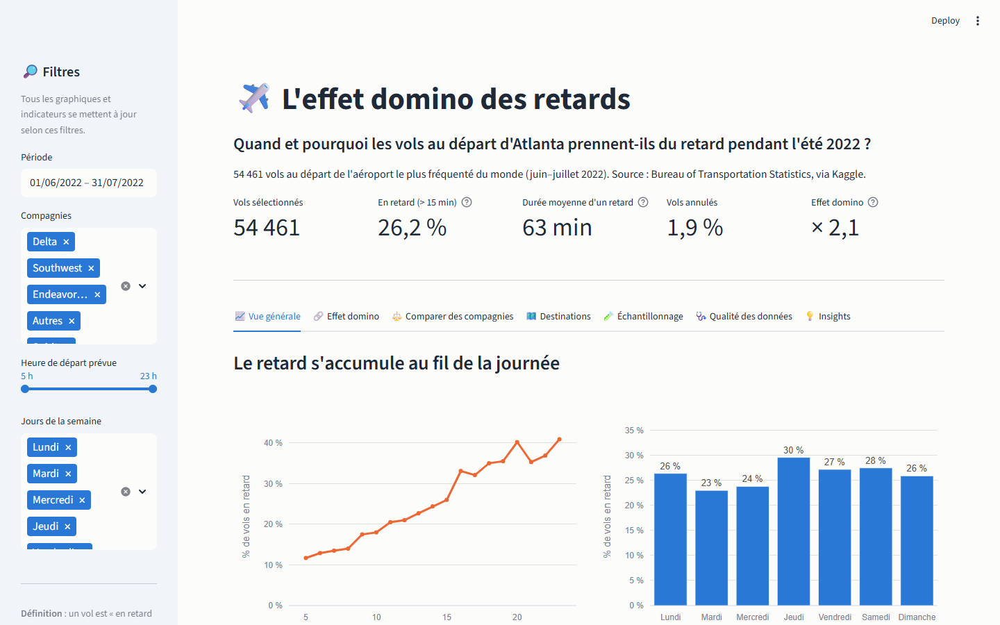
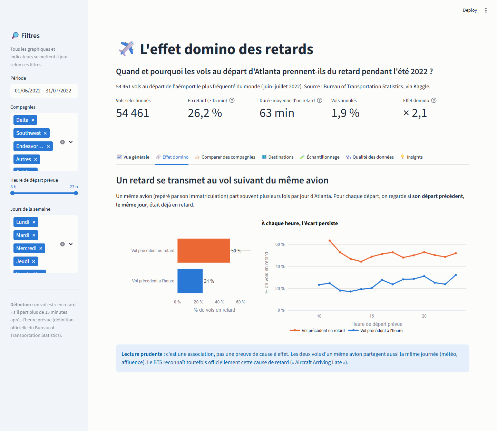
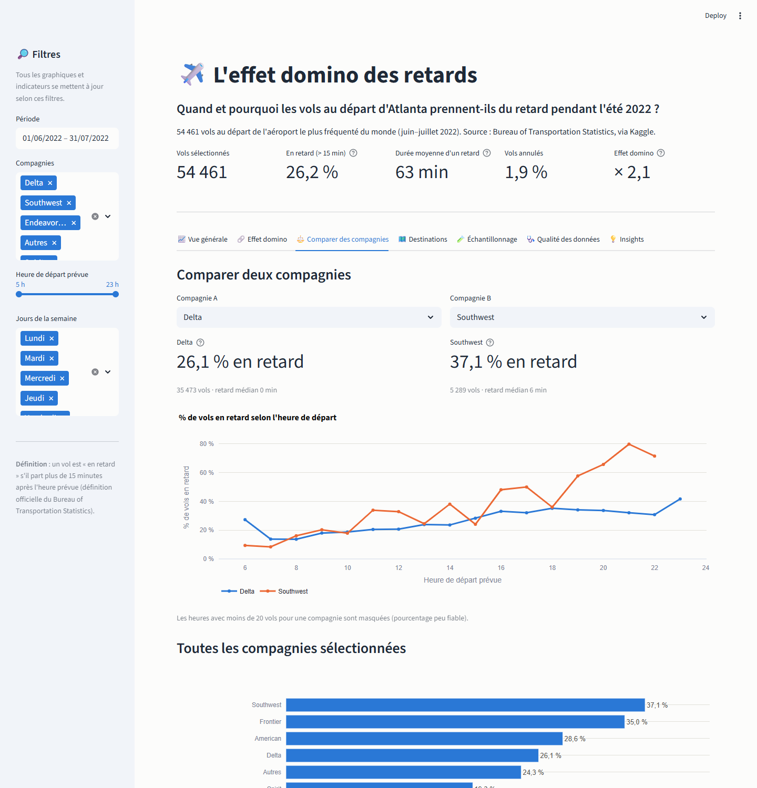

# ✈️ L'effet domino des retards

> **Un retard de vol ne naît pas au hasard : il grandit au fil de la journée.**
> Analyse de 54 461 vols au départ d'Atlanta, l'aéroport le plus fréquenté du monde (été 2022),
> et un dashboard interactif pour explorer quand, où et chez qui les retards apparaissent.

Projet final du module *Visualisation des Données* (Bac+2 Ingénierie des Données).
🔗 **Dashboard en ligne** : *lien ajouté après le déploiement (voir [`docs/MISE_EN_LIGNE.md`](docs/MISE_EN_LIGNE.md))*
· 📄 [Rapport PDF](reports/rapport.pdf) · 🎤 [Présentation](presentation/presentation_finale.pptx)



| Effet domino | Comparaison de compagnies |
|---|---|
|  |  |

---

## Où trouver quoi ?

| Je veux… | Fichier |
|---|---|
| Savoir **ce qui a été fait, étape par étape, et pourquoi** | [`docs/JOURNAL.md`](docs/JOURNAL.md) |
| Comprendre **le dataset et chaque colonne** | [`docs/DATASET.md`](docs/DATASET.md) |
| **Réviser** (notions, code expliqué, questions du prof, chiffres clés) | [`docs/A_APPRENDRE.md`](docs/A_APPRENDRE.md) |
| Relire **le cahier des charges** | [`docs/cahier_des_charges.md`](docs/cahier_des_charges.md) |
| Voir **toute l'analyse** (exploration → insights) | [`notebooks/analysis.ipynb`](notebooks/analysis.ipynb) |
| Ouvrir **le dashboard** | `streamlit run dashboard/app.py` (voir plus bas) |
| Le **rapport** (6 pages) | [`reports/rapport.pdf`](reports/rapport.pdf) |
| La **présentation orale finale** (10 min, texte dans les notes) | [`presentation/presentation_finale.pptx`](presentation/presentation_finale.pptx) |
| La **présentation du rendu d'étape 1** | [`presentation/rendu_etape_1.pptx`](presentation/rendu_etape_1.pptx) |
| Les **graphiques** et **captures du dashboard** | [`reports/figures/`](reports/figures/) · [`reports/captures/`](reports/captures/) |
| **Mettre le projet en ligne** (GitHub + Streamlit Cloud) | [`docs/MISE_EN_LIGNE.md`](docs/MISE_EN_LIGNE.md) |

---

## Problématique

> **Quand et pourquoi les vols au départ d'Atlanta prennent-ils du retard pendant l'été 2022 ?**

1. Quelle est l'ampleur des retards ?
2. Comment le retard évolue-t-il au fil de la journée et de la semaine ?
3. Quelles compagnies et destinations sont les plus touchées ?
4. Le retard au départ se rattrape-t-il en vol ?
5. Un retard se transmet-il au vol suivant du même avion ? (**effet domino**)

## Dataset

- **Source** : Kaggle, [Flight Status Prediction](https://www.kaggle.com/datasets/robikscube/flight-delay-dataset-20182022),
  à partir des données officielles du **Bureau of Transportation Statistics** (États-Unis).
- **Périmètre** : tous les vols au départ d'Atlanta (ATL), **juin et juillet 2022**.
- **Taille** : **54 461 vols × 61 colonnes** (41 numériques, 17 catégorielles, 2 vrai/faux, 1 date).

## Méthodologie

1. **Extraction** du périmètre depuis le fichier Kaggle de 4 millions de vols.
2. **Exploration et qualité** : 0 doublon ; les valeurs manquantes correspondent toutes aux vols annulés/déviés ;
   les retards extrêmes sont de vrais retards et sont gardés.
3. **Nettoyage documenté** : suppression de 10 colonnes constantes, ajout de 8 colonnes utiles (heure, statut, effet domino…).
4. **Échantillonnage** : 5 méthodes comparées (aléatoire, systématique, stratifiée ×2, par grappes), répétées 100 fois.
5. **Analyses** univariées, bivariées et multivariées, chacune répondant à une sous-question.
6. **Dashboard Streamlit** avec filtres (période, compagnie, heure, jour) et graphiques Plotly interactifs.

## Principaux résultats

- **26 %** des vols partent avec plus de 15 minutes de retard.
- Le retard **grandit au fil de la journée** : ≈ 12 % à 6 h contre ≈ 40 % à 20 h.
- **Effet domino** : quand le vol précédent du même avion était en retard, le suivant l'est **une fois sur deux** (50 % contre 24 %), et ce à chaque heure.
- Le retard se joue **au départ** (corrélation départ/arrivée : 0,98) ; la distance ne joue aucun rôle.
- **Southwest (37 %)** et **Frontier (35 %)** sont deux fois plus souvent en retard qu'**Endeavor (18 %)**.

*Associations observées, pas des preuves de causalité.*

## Limites

Un seul aéroport et deux mois d'été ; pas de météo ni de causes détaillées de retard ; les vols retour vers Atlanta
ne sont pas observés ; Delta représente 66 % des vols. Détail : notebook, section 14, et rapport, section 6.

## Technologies

Python · Pandas · NumPy · Matplotlib · Seaborn · Plotly · Streamlit · Jupyter

## Structure du projet

```
dataviz-retards-vols/
├── data/
│   ├── raw/                 # fichier Kaggle (non versionné) + extraction Atlanta
│   └── processed/           # données nettoyées
├── docs/                    # journal, dictionnaire des données, guide de révision, cahier des charges
├── notebooks/analysis.ipynb # l'analyse complète, section par section
├── src/
│   ├── data_loading.py      # extraction du périmètre
│   ├── preprocessing.py     # nettoyage + colonnes ajoutées
│   ├── sampling.py          # 5 méthodes d'échantillonnage + comparaison
│   ├── analysis.py          # calculs (taux de retard, tableaux croisés, KPI)
│   └── visualizations.py    # style visuel commun
├── dashboard/               # dashboard Streamlit (app.py + requirements pour le déploiement)
├── reports/                 # rapport PDF (+ source HTML), figures, captures du dashboard
├── presentation/            # présentation finale + rendu d'étape 1
└── requirements.txt
```

## Lancer le projet

```bash
pip install -r requirements.txt
```

Les données nettoyées sont déjà dans `data/processed/`. Pour tout refaire depuis le début :

1. Télécharger `Combined_Flights_2022.parquet` sur [Kaggle](https://www.kaggle.com/datasets/robikscube/flight-delay-dataset-20182022) et le placer dans `data/raw/`.
2. `python src/data_loading.py` : extrait les 54 461 vols d'Atlanta.
3. `python src/preprocessing.py` : crée le fichier nettoyé.

Ensuite :

```bash
jupyter notebook notebooks/analysis.ipynb
```

```bash
streamlit run dashboard/app.py
```

Avec Anaconda : ouvrir *Anaconda Navigator* → *Jupyter Notebook* → dossier `dataviz-retards-vols/notebooks` → `analysis.ipynb`.
